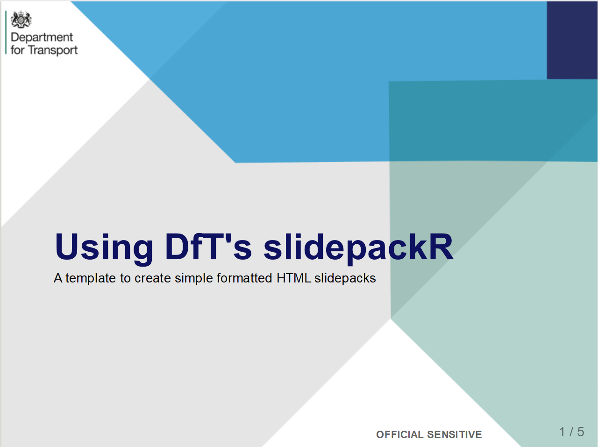
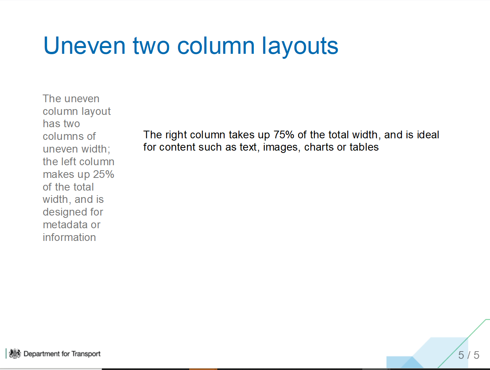
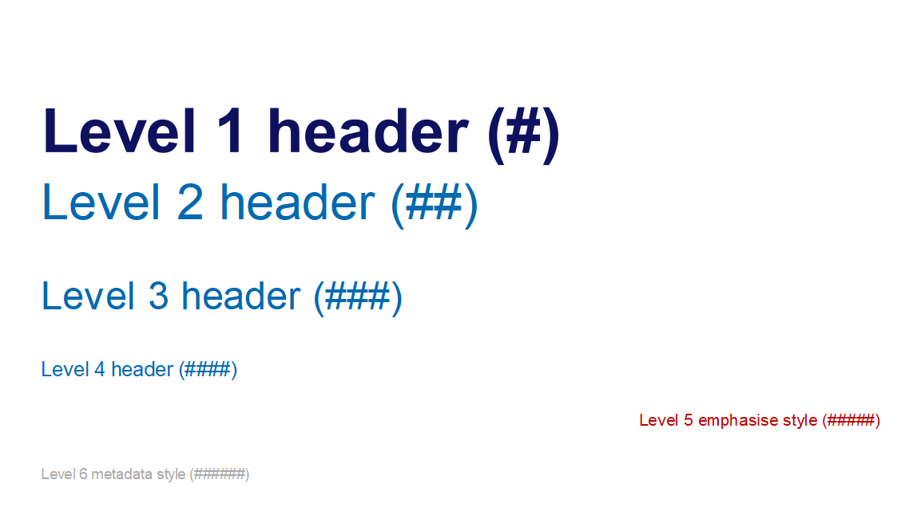

# slidepackR

SlidepackR is a DfT-created R package to build HTML slidepacks in Rmarkdown with custom DfT themes. This package builds on from the xaringan format, allowing people with little or no knowledge of CSS to produce high-quality presentations.

## Installation

The package can be installed directly from Github using the remotes `install_github` call

    install.packages("remotes")
    remotes::install_github("department-for-transport-public/slidepackr")

## Usage

### Setting up the project

The first time you use the slidepackR package in a new project, you will want to run the setup process to ensure you have both the required images and Javascript library to allow the slidepack to knit.

These can be installed automatically by calling `slidepackR::setup_project()`, which by default will setup in the existing working directory.


### Creating a new slidepack

The package includes a template to allow you to create a new slidepack directly in RMarkdown. To do this

* Select File -> New file -> RMarkdown
* In the pop-up window select "from template" and then DfT Slidepack
* A basic slidepackR template structure will be created, which you can then modify as you require.

You can also modify an existing slidepack or other RMarkdown output using the YAML header:

* Your RMarkdown file will have a YAML header at the top, contained within two sets of "---"
* In this, change the output format to `slidepackR::dft_slidepack`
* The RMarkdown file will now knit as a slidepackR format.


### Adding a title slide

The default RMarkdown slidepackR template comes with a title slide included. You can also add a title slide using the `slidepackR::title_slide()` function. As default, this will generate a blank title slide. You can add content to this slide using the title, footer and content arguments, passing the text to include as a string to these arguments. For example:

```slidepackR::title_slide(title = "Using DfT's slidepackR", content = "A template to create simple formatted HTML slidepacks", footer = "OFFICIAL SENSITIVE")```

will return the following title page:



### Adding slides with content

Content slides can be easily created by using the `slidepackR::content_slide()` function. This generates a new slide with a DfT-themed background and a slide number. There is no need to pass any arguments to this function, all slide content can be created below this call in the RMarkdown document, either as R or Markdown content.

### Formatting slide layout

As default, new content slides will have a single open area to add any content to. If you want a structure with two columns, you can add this using the `slidepackR::even_columns()` and `slidepackR::uneven_columns` functions. Both of these functions split the side into two separate columns, dividing the space 50:50 or 25:75 respectively. Content of the two columns is passed to the function as arguments; this can include text, images, charts or tables, e.g.

Due to the CSS formatting involved, both of these functions require the chunk parameter `fig.show = "hide"` to be set in the relevant code chunk.

`slidepackR::uneven_cols(
  "The uneven column layout has two columns of uneven width; the left column makes up 25% of the total width, and is designed for metadata or information",
  "The right column takes up 75% of the total width, and is ideal for content such as text, images, charts or tables"
)`



### Formatting tables 

Data tables can be displayed inside the slidepackR format if they are produced in HTML format. Tables in the correct format can be added using the `slidepackR::table()` function. The table content can be wrapped in this function or piped as for dplyr verbs.

### Formatting text

Text in the slidepackR output is automatically formatted according to the provided default CSS file. Different header styles can be selected using standard markdown "#" header marking.

Level one headers (#) are only used for the title slide. You will want to use level 2 headers (##) for content slide titles. The header formats are as follows:



You can also format individual paragraphs of text to adjust spacing on slides or provide emphasis. This can be done using the `slidepackR::format_text()` function, passing the text to format as the first argument. Additional size, colour and weight arguments can also be provided to set font size, font colour and font weight (i.e. bold text).

